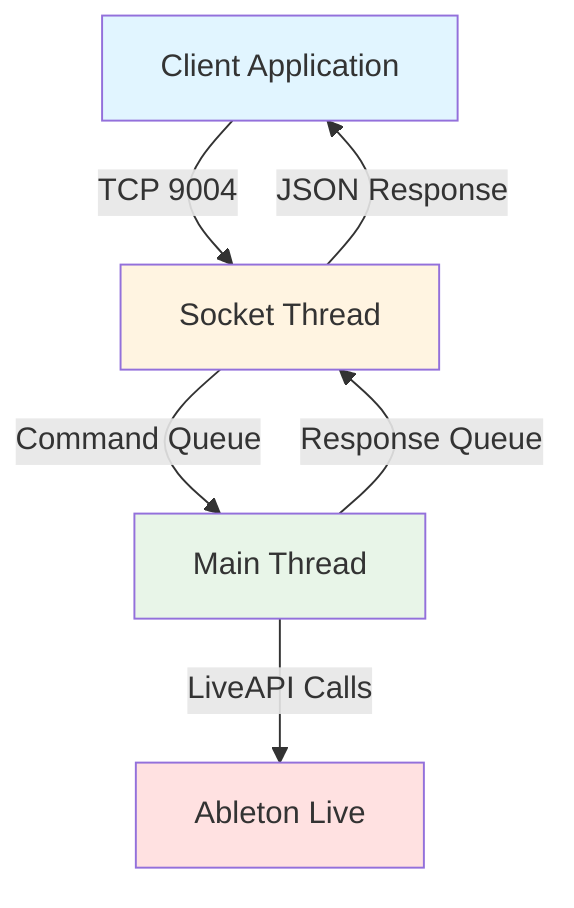
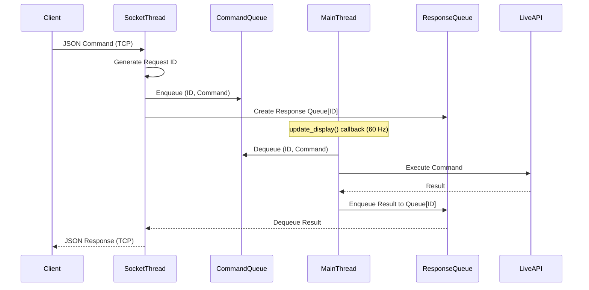
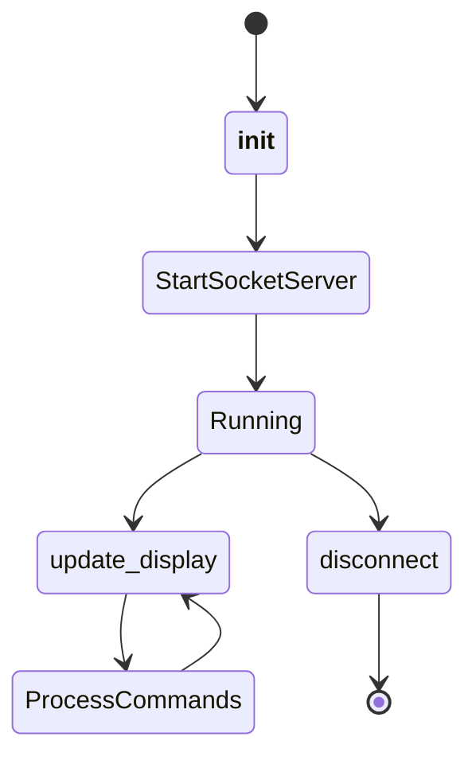
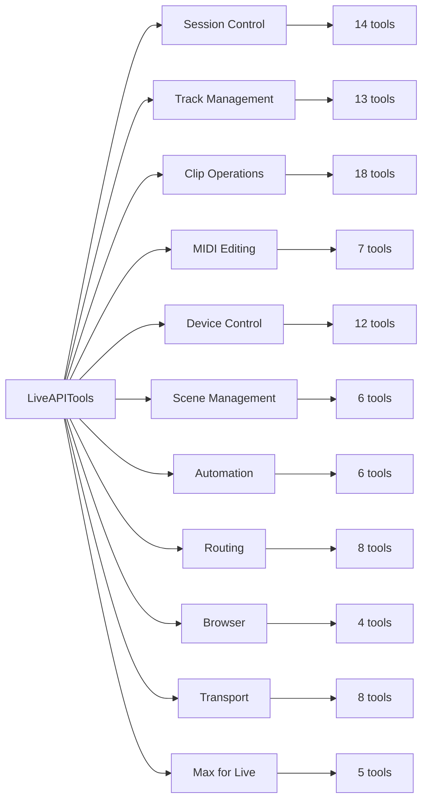
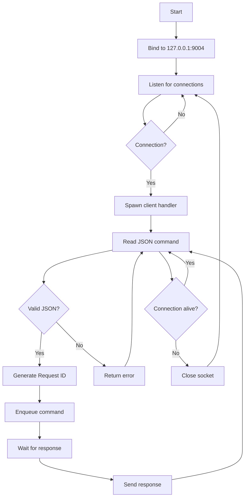
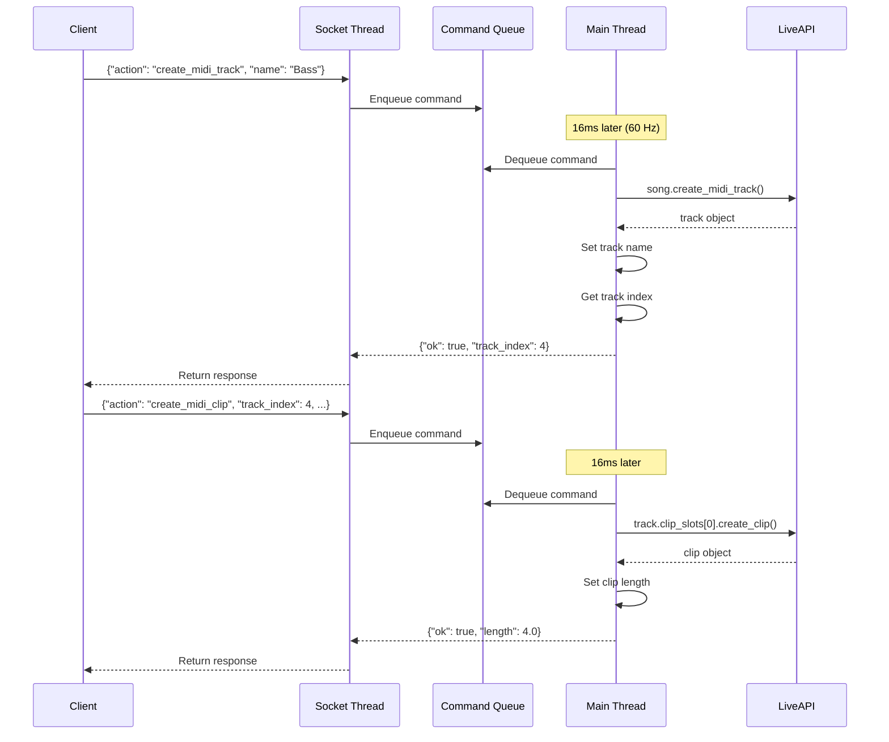
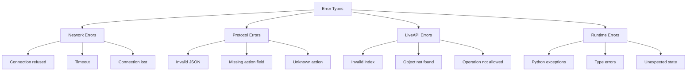

# Architecture Documentation

## System Overview

ClaudeMCP Remote Script implements a thread-safe TCP socket server within Ableton Live's Python environment, exposing LiveAPI functionality through a JSON-based request/response protocol.



## Thread-Safe Architecture

### Problem Statement

Ableton Live's Python Remote Script API requires all LiveAPI calls to execute on the main thread. Direct socket communication from worker threads causes race conditions and crashes.

### Solution: Queue-Based Architecture



## Core Components

### 1. ClaudeMCP Class

Main Remote Script class loaded by Ableton Live.

**Lifecycle:**


**Responsibilities:**
- Initialize LiveAPITools instance
- Start TCP socket server thread
- Process command queue in `update_display()` callback
- Manage response queues for concurrent requests
- Graceful shutdown on disconnect

### 2. LiveAPITools Class

Encapsulates all 125 LiveAPI operations (including Max for Live and CV Tools support).

**Categories:**


### 3. Socket Server Thread

Handles TCP connections on port 9004 (localhost).

**Connection Flow:**


## Communication Protocol

### Request Format

```json
{
  "action": "action_name",
  "param1": "value1",
  "param2": 123
}
```

**Required Fields:**
- `action` (string): Tool/command name

**Optional Fields:**
- Tool-specific parameters (see API Reference)

### Response Format

**Success:**
```json
{
  "ok": true,
  "result_field_1": "value",
  "result_field_2": 123
}
```

**Error:**
```json
{
  "ok": false,
  "error": "Error description"
}
```

### Message Framing

- Messages terminated by newline character (`\n`)
- UTF-8 encoding
- Maximum message size: 4096 bytes per recv() call
- Supports message fragmentation across multiple recv() calls

## Data Flow Example

### Creating a MIDI Track with Clip



## Error Handling

### Error Categories



### Error Propagation

1. **LiveAPI Errors**: Caught in tool method, returned as `{"ok": false, "error": "..."}`
2. **Network Errors**: Caught in socket thread, connection closed
3. **Protocol Errors**: Returned as error response, connection maintained
4. **Runtime Errors**: Logged to Ableton log, returned as error response

## Performance Characteristics

### Latency Analysis

| Operation | Latency | Notes |
|-----------|---------|-------|
| Socket connection | <1ms | Localhost TCP |
| Command transmission | <1ms | Small JSON payloads |
| Queue wait time | 0-16ms | Depends on `update_display()` timing |
| LiveAPI execution | 1-100ms | Varies by operation |
| Response transmission | <1ms | Small JSON payloads |

**Total Round-Trip Time**: 2-120ms typical

### Throughput

- **Commands/second**: Limited by `update_display()` rate (~60 Hz)
- **Concurrent connections**: Multiple clients supported
- **Queue depth**: Unbounded (limited by available memory)

### Resource Usage

- **Memory**: ~5MB (Python interpreter + script)
- **CPU**: <1% idle, 2-5% under load
- **Network**: Localhost only (no external bandwidth)

## Security Considerations

### Current Implementation

- **Bind address**: `127.0.0.1` (localhost only)
- **Authentication**: None
- **Encryption**: None (plaintext TCP)
- **Authorization**: All commands allowed

### Threat Model

**Localhost-only binding** mitigates:
- Remote network attacks
- Unauthorized LAN access
- Man-in-the-middle attacks

**Remaining risks**:
- Local privilege escalation (any local process can connect)
- Malicious software on same machine
- Compromised user account

### Recommendations for Production

1. **Remote Access**: Only enable `0.0.0.0` binding on trusted networks
2. **Authentication**: Implement token-based authentication for remote access
3. **Encryption**: Use TLS/SSL wrapper for network transmission
4. **Authorization**: Add role-based command filtering
5. **Rate Limiting**: Prevent command flooding/DoS
6. **Audit Logging**: Record all commands for security analysis

## Extension Points

### Adding New Tools

1. Add method to `LiveAPITools` class (`liveapi_tools.py`):
   ```python
   def new_tool(self, param1, param2):
       """Tool description"""
       try:
           # LiveAPI calls
           result = self.song.some_operation()
           return {"ok": True, "result": result}
       except Exception as e:
           return {"ok": False, "error": str(e)}
   ```

2. Add dispatcher in `ClaudeMCP._process_command()` (`__init__.py`):
   ```python
   elif action == 'new_tool':
       return self.tools.new_tool(
           command.get('param1'),
           command.get('param2')
       )
   ```

3. Add to `get_available_tools()` list

### Alternative Transport Layers

The architecture supports replacing TCP sockets with:
- **WebSocket**: Bidirectional, browser-compatible
- **HTTP/REST**: Stateless, easier client integration
- **OSC**: UDP-based, common in music software
- **Named Pipes**: Inter-process communication (same machine)

Replace socket server thread while maintaining queue-based main thread communication.

## Comparison to Alternatives

| Approach | Thread Safety | Performance | Complexity |
|----------|--------------|-------------|------------|
| Queue-based (this) | Yes | Good | Medium |
| Direct socket calls | No | N/A (crashes) | Low |
| Live.API | Limited | Poor | Low |
| Max for Live | Yes | Good | High |
| MIDI Remote Script | Limited | Excellent | Medium |

## References

- [Ableton Live Python API](https://docs.cycling74.com/max8/vignettes/live_api_overview)
- [Python Remote Scripts Framework](https://github.com/gluon/AbletonLive11_MIDIRemoteScripts)
- [Model Context Protocol](https://modelcontextprotocol.io/)
